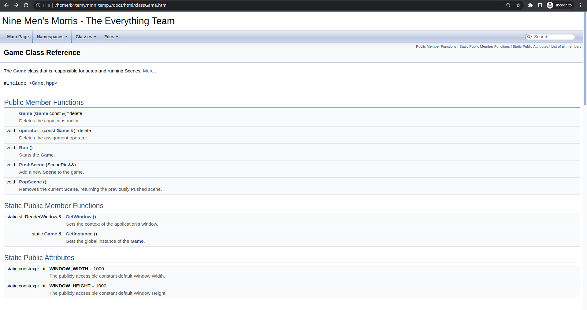

# Nine Men's Morris - Documentation
## Building Documentation
We use [Doxygen](https://www.doxygen.nl/index.html) for our documentation. To use it, `cd` into
the docs directory, run `doxygen Doxyfile`, and in the `docs/html` directory there should be an `index.html`
file you can open in your preferred web browser.

```bash
cd docs
doxygen Doxyfile
```
Now  you should have a file in `docs/html/index.html`

## Screenshots

(The default page when you open `index.html`. Hover over `Namespaces`, `Classes`, or `Files`, and
select an option that you want to know more about.)


(Here you can see the classes we wrote and a one-line description of it. You can then click
on the class to see more details about that specific class.)



(Here, I have selected the `Game` class and was brought to this page. Here, I can see the documentation
for the members of the class.)


(Note you can also see the inheritance diagram for classes that inherit from another class, which
I demonstrate here with the `CaptureCommand` documentation.)


## (Optional) PDF Generation
If you would prefer having a single PDF to look through (not recommended, as there would be no "links" to
different pages for different classes), you can run the following commands _after_ building the HTML documentation. 
Note that you would need to have `GNU make` and `latex` installed.

```
cd latex
make
cp refman.pdf ../documentation.pdf
```

The resulting PDF file should be in `<project_root>/docs/documentation.pdf`, which you can open in your
preferred PDF reader.


(The generated PDF should look something like this)
