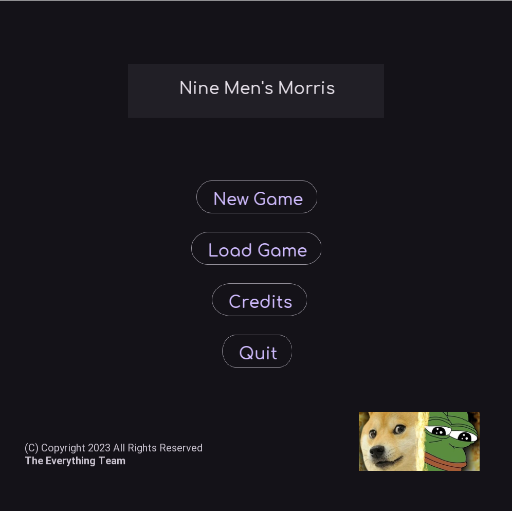

  

# Nine Men's Morris - The Everything Team

A C++ implementation of Nine Men's Morris using SFML for the FIT3077 unit in Monash (Malaysia).

## Pre-built binaries
- [Windows MSVC Release Build (Recommended)](http://everything-nmm.s3-website-ap-southeast-1.amazonaws.com/EverythingNMM-3dab188-MSVC-Windows.zip)
- [Windows MinGW Release Build (Backup)](http://everything-nmm.s3-website-ap-southeast-1.amazonaws.com/EverythingNMM-08344b4-MingW-Windows.zip)
- [Linux AppImage](http://everything-nmm.s3-website-ap-southeast-1.amazonaws.com/Everything-NMM-html/index.html)

For Windows builds, unzip the archive and double click the `EverythingNMM.exe` file. If Windows Defender gives a warning, please allow for the program to run.

For Linux builds, unzip the archive and double click the `EverythingNMM.AppImage` file. Depending on your distro, you may see a warning about executing unknown files. Please click Allow.

## How to Play Nine Men's Morris

Please see the [Nine Men's Morris](https://en.wikipedia.org/wiki/Nine_men%27s_morris) Wikipedia page 
for the rules of the game. In particular, note that
1) You cannot "Capture" an opponent's tokens if it is in a Mill. However, if all of the opponent's tokens are in a Mill, you can
capture that.
2) After a player moves, and the opponent does not have a valid move, then the opponent loses.

In our game, we assign a frog and dog mascot for Player 1 and Player 2, so their tokens
will be represented using images of these animals. We refer to these mascots as "Doge" for the
dog, and "Pepe" for the frog.

Also note that in our implementation, when you enter "capture" mode after forming a Mill,
the images of the opponent's tokens that _can_ be captured will have a different image,
indicating that it can be captured. 

It is the "Doge" player's turn, and the player is about to form a Mill on the rightmost
vertical line.

Now that "Doge" has formed a Mill, he is in Capture Mode. Note that the top left "Pepe"
has changed textures to one where the frog is crying and in distress. This indicates
that this token can be captured after clicking on it.

On the other hand, the three white "Pepe"s on the vertical line cannot be captured,
as they form a Mill, and you cannot capture opponent's tokens that are in a Mill (unless
all the opponent's tokens are in a Mill, which is not the case).

## Screenshots

(Title Screen)

(Game Screen)

(During a Game)

## Requirements
- A C++ Compiler. Tested with g++, clang++, MinGW and MSVC.
- [CMake](https://cmake.org/) 3.0 or higher.
- (Optional) [Doxygen](https://www.doxygen.nl/). This is for generating the documentation
from the source code comments, and outputting it onto HTML pages in the docs directory, or
optionally into a PDF.

Optionally, you can use Visual Studio as well. You do not need to build any of the
libraries used (such as SFML), as they will be fetched and compiled by CMake.

## Building
See: [BUILDING.md](BUILDING.md) for detailed instructions on how to build for several different
platforms.

Please note that the previous "BUILDING.md" text is a link. There are detailed instructions on how to compile
the project in there, including a way to build the project using Docker.
Please take a look at it if you wish to compile the project.

## Documentation
Note that the docs directory is rather empty because it is meant to be used as an output
directory for Doxygen. The existing markdown files there are inputs for the main page
for the Doxygen generated output.

See: [DOCS.md](DOCS.md) for instructions on how to build the documentation.

Note that the previous line contained a link with detailed instructions on how to generate the documentation.
Please take a look as it helps immensely to understand the structure and general 
feel of the codebase. Note that things like design rationale and sequence/class diagrams
are not in here, as this is just the generated output from the in-code comment documetation, 
and the diagrams/rationale are instead in the `Sprint X` directories.
